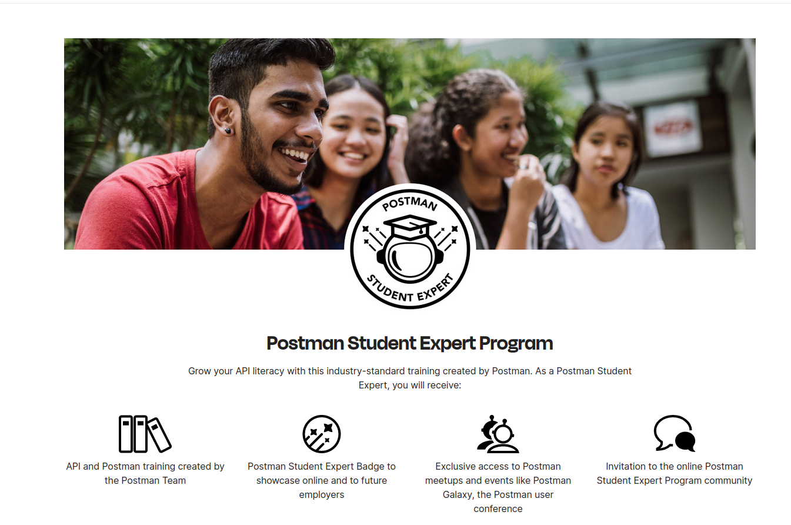
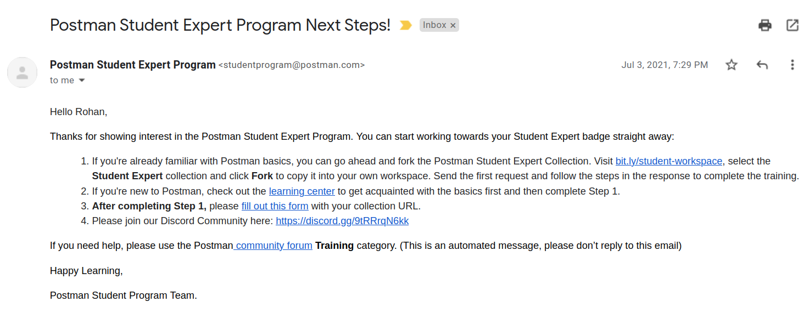
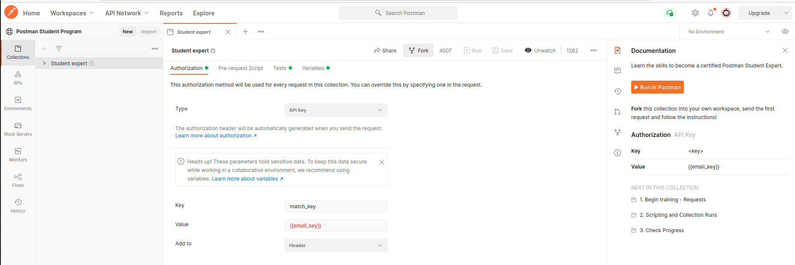

<h1 align='center'> APPLY TO BE STUDENT EXPERT</h1>

<h3 align='center'><a  href='https://docs.google.com/forms/d/e/1FAIpQLSeXYUXbptNSve8dzquJzV6O3PtfWaSqx-Y1BjemYoM9m9168A/viewform'>Apply</a></h3>

<ul>
<li>After Application you will get Mail from Postman regarding further steps.</li>

<li>In this mail you will get link to Postman Workspace of Student Expert Collection</li>
<li>You will navigate to the link and fork the collection in your workspace</li>

<li>After Opening the collection you will click on fork and provide a label (optional) and select your workspace to forking collection.</li>
<li>Forking a Collection means Creating your copy of collection.</li>
<li>And you are all set to go.</li>
</ul>
