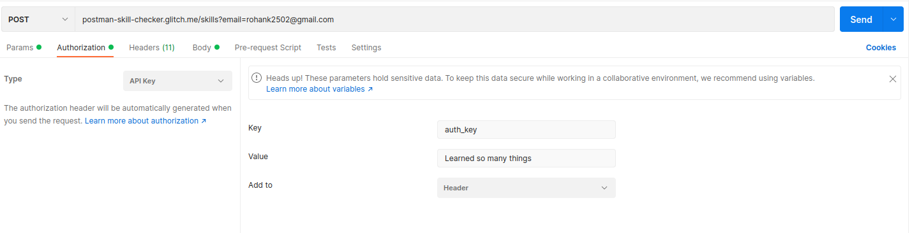
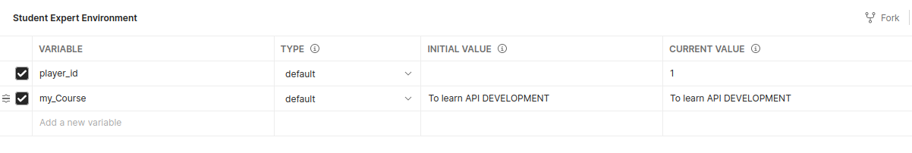

<h1>Check Progress</h1>

<ul>
<li>In this when you send the request you will get a check list which is incomplete.You need to complete it.</li>
<li>Change the request method to POST or PUT click save and send the requst again. You will be able to see green tick after first check.</li>
<li>Next task is to send email as key</li>

```
postman-skill-checker.glitch.me/skills?email=rohank2502@gmail.com
```
    
<li>Make sure your url looks like this with your email. Save request and send it.</li>
<li>In next task you need to send data in the body.So go to body section and click raw select type as json and then enter your name in body as follow.Save request and send it.</li>

```
{
    "name":"Rohan Kulkarni"
}
```

<li>In next task you need to setup the API key in authorization.Go to authorization tab and from drop down select API KEY. Enter key as "auth_key" and value as answer to question how much you learned from student expert.Make sure your screen looks like this and save the request and send it.</li>



<li>Now we need to add one more variable in environment.Go to the eye icon click on edit and add one more variable user player_id with name "myCourse" and in the initial value write your objective to take this course.Make sure your response looks like this.Save request and send it.</li>


<li>Next task is to add test script.Make sure your script matches this and then save it and send the request.<li>

```
pm.environment.set("responseData", pm.response.json().rand);
```

<li>Now you need to check the test collection.Click on the collection you will get option to share the collection.Click on the JSON link.Copy the json link and paste in the request of TEST Collection. And Send it.If all 11 Checks are passed you can submit this link in the form and if now you need to check which test is not passed and do the work agian.</li>
</ul>
